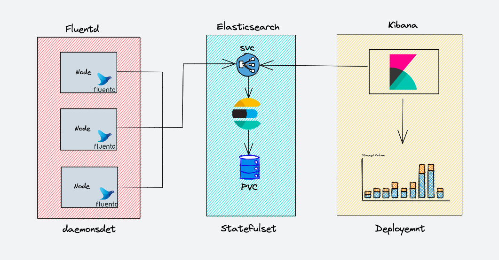

# EFk Stack on Kubernetes
EFK Stands for ElasticSearch, Fluentd, and Kibana. EFK is the popular and open-source choice for the Kubernetes log aggregation and analysis.
1. **Elasticsearch** is a distributed ans scalable search engine commonly used to shift through large volumes of data log. It is a NoSQL database based on the Lucene search engine (search library from Apache). It's primary work is to store logs and retrive logs from fluentd.
2. **Fluentd** is a log shipper. It is an open source log collection agent which support multiple data sources and output formats. Also it can forward logs to solutions like Stackdriver, CLoudwatch, elasticsearch, Splunk, Bigquery and much more. TO be short, it's an unifying layer between systems that generate log data and systems that store log data.
3. **Kibana** is UI tool for querying, data visualization and dashboards. It is a query engine which allows you to explore your data through a web interface, build visualizations for events log, query-specific to filter information for detecting issues. We can visually build any type of dashboards using kibana. **Kibana Query Language (KQL)** is used for querying elasticsearch data. Here we use kibana to query **indexed data in elasticsearch.**

## EFK Architecture


EFK Components gets deployed as folows
1. **Fluentd** :- Deployed as DaemonSet as it need to collect te container logs from all the nodes. It connects to the ElasticSearch service endpoint to forward the logs
2. **ElasticSearch** :- Deployed as StatefulSet as it holds the log data. We also expose the service endpoint for Fluentd and Kibana to connect to it.
3. **Kibana** :- Deployed as deployment and connects to elasticsearch service endoint.

## Create a `kube-logging` Namespace
- We can define the `kube-logging` namespace using the below manifest
  
    ```
    apiVersion: v1
    kind: Namespace
    metadata:
        name: kube-logging
    ```
- To create the Namespace that we defined, we can use te below command
  
    ```
    $ kubectl apply -f namespace.yaml
    namespace/kube-logging created
    ```

## Deploy ElsticSearch StatefulSet
- ElasticSearch is deployed as **StatefulSet** and the multiple replicas connect with each other using a headless service. The headless service helps in the DNS domain of the pods.

    ### ElasticSearch Headless Service
    - The service manifest for ElasticSearch StatefulSet will be as below.
    
        ```
        apiVersion: v1
        kind: Service
        metadata:
        name: elasticsearch
        labels:
            app: elasticsearch
        spec:
        selector:
            app: elasticsearch
        clusterIP: None
        ports:
            - port: 9200
            name: rest
            - port: 9300
            name: inter-node
        ```

    - Create the Headless service for ElasticSearch using the below command
    
        ```
        $ kubectl apply -f elasticsearch/service.yaml 
          service/elasticsearch created
        ```
    - TO view the details of the service created, we can use the below command
  
        ```
        $ kubectl get svc/elasticsearch -n kube-logging -o wide
          NAME            TYPE        CLUSTER-IP   EXTERNAL-IP   PORT(S)             AGE   SELECTOR
          elasticsearch   ClusterIP   None         <none>        9200/TCP,9300/TCP   46s   app=elasticsearch
        ```

    - We define a `Service` called `elasticsearch` in the `kube-logging` Namespace, and five it the `app: elasticsearch` label.
    - We then set the `.spec.selector` to `app: elasticsearch` so that the Service selects Pods with the `app: elasticsearch` label.
    - When we assign our ElasticSearch StatefulSet with this Service, the Service will return DNS A records that point to ElasticSearch Pods with the `app: ealsticsearch` label
    - We then set `clusterIP: None`, which renders the service headless. Finally we define ports 9200 and 9300 which are used to interact with REST API and for inter-node communication.
    
    ### ELasticSearch StatefulSet
    - A Kubernetes StatefulSet allows you to assign a stable identity to Pods and grant them stable, persistent storage.
    - ElasticSearch requires stable storage to persist data across Pod rescheduling and restarts.
        
        ```
        # Deploying elasticsearch as StatefulSet
        ---
        apiVersion: apps/v1
        kind: StatefulSet
        metadata:
        name: elasticsearch-cluster
        spec:
        replicas: 3
        serviceName: elasticsearch
        selector:
            matchLables:
            app: elasticsearch
        strategy:
            rollingUpdate:
            maxUnavailable: 1
        template:
            metadata:
            labels:
                app: elasticsearch
            spec:
            containers:
                # Main ElasticSearch Container definition
                - name: elasticsearch
                image: docker.elastic.co/elasticsearch/elasticsearch:7.5.0
                resources:
                    limits:
                    cpu: 1000m
                    requests:
                    cpu: 100m
                ports:
                    - name: rest
                    containerPort: 9200
                    protocol: TCP
                    - name: inter-node
                    containerPort: 9300
                    protocol: TCP
                volumeMounts:
                    - name: data
                    mountPath: /usr/share/elasticsearch/data
                env:
                    - name: cluster.name
                    value: k8s-logs
                    - name: node.name
                    valueFrom:
                        fieldRef:
                        fieldPath: metadata.name
                    - name: discovery.seed_hosts
                    value: "es-cluster-0.elasticsearch,es-cluster-1.elasticsearch,es-cluster2.elasticsearch"
                    - name: Cluster.initial_master_nodes
                    value: "es-cluster-0,es-cluster-1,es-cluster-2"
                    - name: ES_JAVA_OPTS
                    value: "-Xms512m -Xmx512m"
            
            # init containers to fix permission issues
            initContainers:
                - name: fix-permissions
                image: busybox
                command: ["sh", "-c", "chown -R 1000:1000 /usr/share/elasticsearch/data"]
                securityContext:
                    privileged: true
                volumeMounts:
                    - name: data
                    mountPath: /usr/share/elasticsearch/data
                - name: increase-vm-max-map
                image: busybox
                command: ["systemctl","-w","vm.max_map_count=262144"]
                securityContext:
                    privileged: true
                - name: increase-fd-ulimit
                image: busybox
                command: ["sh", "-c", "ulimit -n 65536"]
                securityContext:
                    privileged: true

            # defining the volume claim template for the elasticsearch container to store logs
            volumeClaimTemplates:
                - metadata:
                    name: data
                    lables:
                    app: elasticsearch
                spec:
                    accessModes: ["ReadWriteOnce"]
                    resources:
                    requests:
                        storage: 3Gi

        ```
    - To create the statefulset we can use the below command
        ```
        $ kubectl apply -f elasticsearch/statefulset.yaml
        statefulset.apps/elasticsearch-cluster created
        ```
    - 
    - We define a StatefulSet called `es-cluster` in the `kube-logging` namespace We then associate it with previously created `elasticsearch` Service using  `serviceName` field.
    - This ensures that each Pod in the StatefulSet will be accessible using the following DNS addresses: `es-cluster-[0,1,2].elasticsearch.kube-logging.svc.cluster.local`, where `[0,1,2]` corresponds to the Pod's assigned integer ordinal.
    - We Specify 3 `replicas` and set the `matchLabels` selector to `app: elasticsearch`, which we then mirror in the `.spec.template.metadata` section.
    - We name the containers `elasticsearch` and choose the `docker.elastic.co/elasticsearch/elasticsearch:7.2.0` Docker image.
    - We then use `resources` field to specify that the container nees at leas 0.1 vCPU guranteed to it. and can burst up to 1 vCPU.
    - We then open and name ports `9200` and `9300` for REST and inter-node communication, respectively. We specify a `volumeMount` called `data` that will mount the PersistentVolume names `data` to the container at the path `/usr/share/elasticsearch/data`.
    - Finally we set some environment variables in the container
      - `cluster.name`: The ElasticSearch cluster's name, which in this guide is `k8s-logs`.
      - `node.name` : The node's name, ehich set to the `.metadata.name` field using `valueFrom`. This will resolve to `es-cluster-[0,1,2]`, depending on the node's assigned ordinal.
      - `discovery.seed_hosts` : This field sets a list of master-eligible nodes in the cluster that will seed the node discovery process. In this guide, we use headless service to configure. our Pods have domains of the form `es-cluster-[0,1,2].elasticsearch.kube-logging.svc.cluster.local`, so we set this environment variable accordingly. Using local namespace K8S DNS resolution, we csn shorten this to `es-cluster-[0,1,2].elasticsearch`
      - `cluster.initial_master_nodes` : This field also specifies a list of master-eligible nodes that will participate in the master election process. Note that for this field you should identify nodes by their `node.name` and not their hostnames.
      - `ES_JAVA_OPTS` : Here we set this to `-Xms512m -Xms512m` which tells the JVM ti use a minimum and maximum heapsize of 512 MB. You should tune these parameters depending on your cluster's resource availability and needs.
    - We define several init containers that run before the main elasticsearch app container. These init containers each run to completion in the order they are defined.
    - The first, named fix-permissions, runs a `chown` command to change the owner and group of the ElasticSearch data direcotory to `1000:1000`, the Elasticsearch user's UID. By defult kubernetes mounts the data direcotry as root, which renders it inaccessible to ElasticSearch.
    - The next init Container to run is `increates-fd-limit`, which runs the `ulimit` command to increase the maximun number of open file descriptors.
    - Next, we define the StatefulSet `VolumeClaimTemplates`. Kubernetes will use this to create PersistentVolumes for the Pods. In the block above, we name it `data`. We gave it the same `app: elasticsearch` label as our StatefulSet.
    - we then specify its access mode as `ReadWriteOnce`, which means that it can only be mounted as read-write by a single node.
    - Finally we specify that we'd like each PeristentVilume to be 3GiB size. You should adjust this value depending on your production needs.